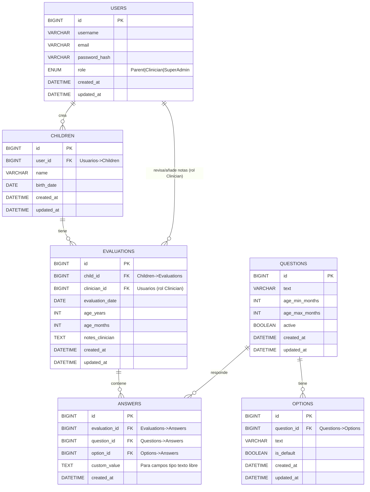

// sql/diagram.md

```mermaid
erDiagram
    USERS {
        BIGINT id PK
        VARCHAR username
        VARCHAR email
        VARCHAR password_hash
        ENUM role "Parent|Clinician|SuperAdmin"
        DATETIME created_at
        DATETIME updated_at
    }
    CHILDREN {
        BIGINT id PK
        BIGINT user_id FK "Usuarios‑>Children"
        VARCHAR name
        DATE birth_date
        DATETIME created_at
        DATETIME updated_at
    }
    EVALUATIONS {
        BIGINT id PK
        BIGINT child_id FK "Children‑>Evaluations"
        BIGINT clinician_id FK "Usuarios (rol Clinician)"
        DATE evaluation_date
        INT age_years
        INT age_months
        TEXT notes_clinician
        DATETIME created_at
        DATETIME updated_at
    }
    QUESTIONS {
        BIGINT id PK
        VARCHAR text
        INT age_min_months
        INT age_max_months
        BOOLEAN active
        DATETIME created_at
        DATETIME updated_at
    }
    OPTIONS {
        BIGINT id PK
        BIGINT question_id FK "Questions‑>Options"
        VARCHAR text
        BOOLEAN is_default
        DATETIME created_at
        DATETIME updated_at
    }
    ANSWERS {
        BIGINT id PK
        BIGINT evaluation_id FK "Evaluations‑>Answers"
        BIGINT question_id FK "Questions‑>Answers"
        BIGINT option_id FK "Options‑>Answers"
        TEXT custom_value "Para campos tipo texto libre"
        DATETIME created_at
    }
    USERS ||--o{ CHILDREN : "crea"
    CHILDREN ||--o{ EVALUATIONS : "tiene"
    USERS ||--o{ EVALUATIONS : "revisa/añade notas (rol Clinician)"
    QUESTIONS ||--o{ OPTIONS : "tiene"
    EVALUATIONS ||--o{ ANSWERS : "contiene"
    QUESTIONS ||--o{ ANSWERS : "responde"
```
